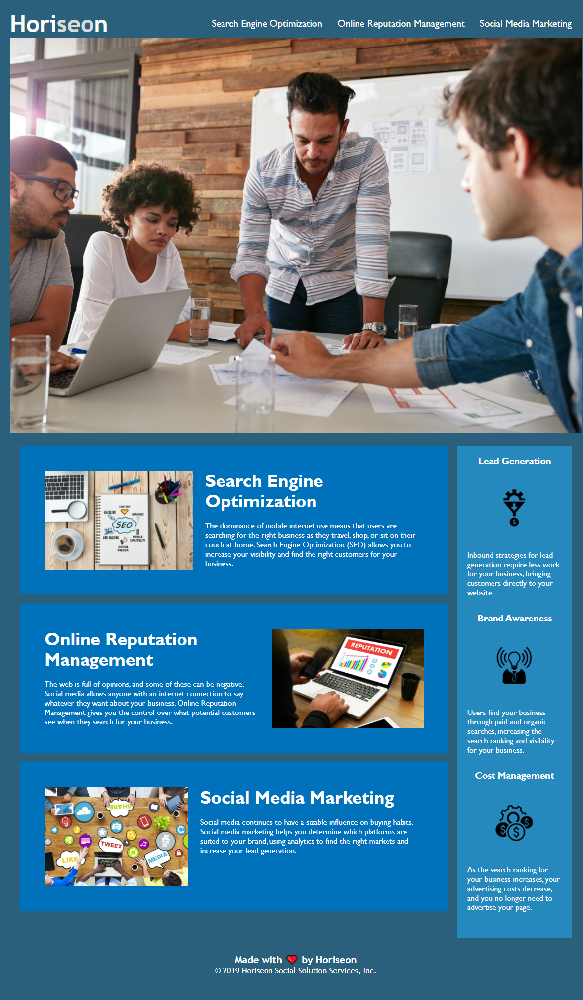

# Project Name - Homework 1

## Table of contents

- [Overview](#overview)
  - [The challenge](#the-challenge)
  - [User Story](#user-story)
  - [Acceptance Criteria](#acceptance-criteria)
  - [Screenshot](#screenshot)
  - [Links](#links)
- [My process](#my-process)
  - [Built with](#built-with)
  - [What I learned](#what-i-learned)
  - [Continued development](#continued-development)
  - [Useful resources](#useful-resources)
- [Author](#author)
- [Acknowledgments](#acknowledgments)

**Note: Delete this note and update the table of contents based on what sections you keep.**

## Overview

### The challenge

Refactor a provided starter code to make it more accessible

### User Story

AS A marketing agency
I WANT a codebase that follows accessibility standards
SO THAT we increase the search engine optimization

### Acceptance Criteria

GIVEN a webpage meets accessibility standards
WHEN I view the source code
THEN I find semantic HTML elements
WHEN I view the structure of the HTML elements
THEN I find that the elements follow a logical structure independent of styling and positioning
WHEN I view the icon and image elements
THEN I find accessible alt attributes
WHEN I view the heading attributes
THEN they fall in sequential order
WHEN I view the title element
THEN I find a concise, descriptive title

### Screenshot

### Links

- Live Site URL: [Add live site URL here](https://ocampoad.github.io/Homework1/)

## My process

### Built with

- Semantic HTML5 markup
- CSS selectors
- Remove repeating selectors and attributes
- Comments

### What I learned

This challenge helped me learn about semantic html markups such as ``<header>`` and ``<navigation>``
I also learned and applied keeping CSS selectors and attributes dry by reducing duplicates. 
I enjoyed seeing how my code affected, or did not affect, the rendered file. 

### Continued development

I think I have a pretty good grasp of semantic html elements and CSS selectors and attributes, but I would like to further develop my skills in CSS. There are so many attributes to play around with each having its own syntax. I would also like to understand markdown language; the portability of markdown seems valuable to learn. 

### Useful resources

- [W3school- HTML](https://www.w3schools.com/html/default.asp) - W3school gave examples as they described html elements which helped visualize the code.
- [W3school- CSS](https://www.w3schools.com/css/default.asp) - This provided an in-depth yet easy to access guide to CSS elements. 
- [Markdown Guide](https://www.markdownguide.org/) - This was a great guide to dive into markdown
- [GIT Guide](https://github.com/git-guides) - This guide helped me get through creating repositories, cloning and pushing codes. 

## Author

- Website - [Adriane Ocampo](https://ocampoad.github.io/Homework1/)

## Acknowledgments

I want to thank Emmanuel for teaching us the ropes of HTML and CSS. I want to thank Scott for providing resources for us to further our understand of each concept. I want to thank Matthew for helping me with my ssh key problems. 
